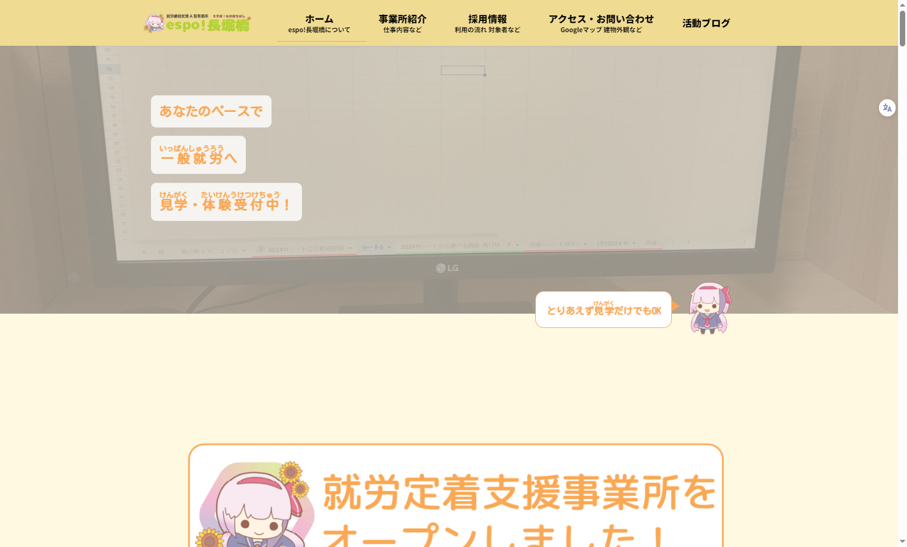

# lightning-child カスタムテーマ

このテーマは、[Lightning 無料版テーマ](https://ja.wordpress.org/themes/lightning/) をベースにした **カスタム子テーマ** です。  
A型就労継続支援事業所 espo！長堀橋の公式ホームページで使用しています。
デザイン・機能を柔軟に拡張し、保守・運用しやすくする目的としています。

## 🔧 特徴

- Lightning無料版をベースにした安定動作
- 不要なブロック削除など**軽量化**
- カスタムテンプレートやウィジェット追加
- GitHub Actionsによる**自動デプロイ構成**

## 👚 スクリーンショット

## 📦 ファイル構成

| ファイル | 内容 |
|---------|------|
| `style.css` | テーマ情報とスタイルの読み込み |
| `assets` | 独自CSS・JSの読み込み |
| `functions.php` | スクリプト登録・フック処理など |
| `screenshot.png` | WordPress管理画面用サムネイル画像 |
| `.github/workflows/` | GitHub Actionsによる自動化設定 |

## 🚀 デプロイ・自動化

本テーマは GitHub Actions を使用して、  
Xserver 上の WordPressテーマディレクトリに自動デプロイされます。

> SSH + Git pull による CI/CD構成が組まれています。

## 🧙‍♂️ 作者情報（任意）

| 項目 | 内容 |
|------|------|
| 名前 | Leon（LazyGenius） |
| GitHub | [@Leon20200809](https://github.com/Leon20200809) |
| 所在地 | Osaka, JP |

---

## 💬 補足

カスタマイズ内容や導入方法の詳細は `readme-G3.md` に記載しています。  
質問・不具合報告などは Issues にてどうぞ。

